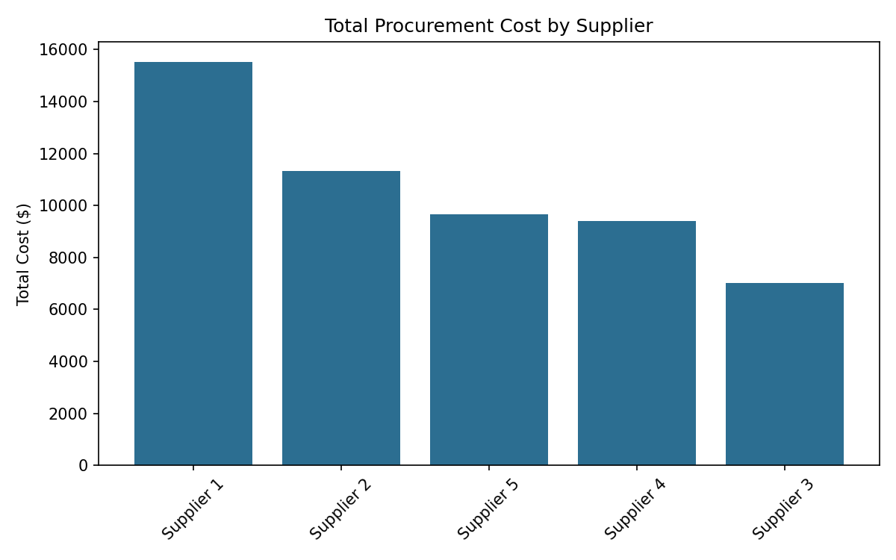
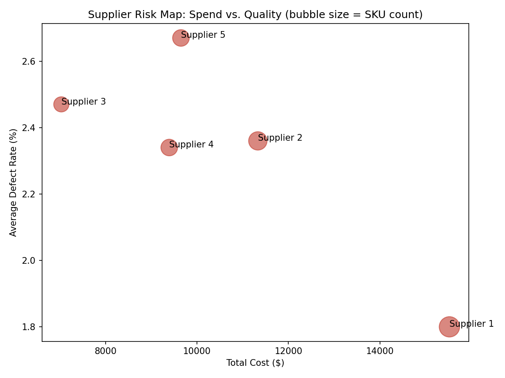

# Supplier Performance & Spend Analysis

## Overview
A supplier scorecard analysis evaluating cost, quality and lead time across five 
suppliers in a manufacturing/retail supply chain dataset. Built to identify whether 
spend concentration aligns with supplier performance; a core procurement question 
when deciding where to consolidate or renegotiate.

**Note:** This uses a synthetic Kaggle dataset (100 SKUs, 5 suppliers) for 
methodology demonstration. Supplier names are anonymized placeholders, not real 
companies. The value here is the analytical framework, which applies directly to 
real procurement spend data.

## Objective
Determine whether high-spend suppliers are also high-performing suppliers or 
whether cost concentration is masking quality/delivery risk.

## Data
- Source: [Supply Chain Analysis dataset, Kaggle](https://www.kaggle.com/datasets/harshsingh2209/supply-chain-analysis)
- 100 rows (SKU-level), 24 columns including cost, defect rate, lead time and 
  supplier fields
- No missing values; used as-is after supplier-level aggregation

## Method
1. Aggregated SKU-level data to supplier-level scorecard: total cost, cost share %, 
   average defect rate, average lead time, average shipping cost, SKU count
2. Ranked suppliers by cost and by defect rate to identify misalignment between 
   spend and performance
3. Visualized cost distribution (bar chart) and cost-vs-quality positioning 
   (scatter, bubble-sized by SKU count)

## Key Finding
Supplier 1 holds the largest cost share (29.3%) but the *lowest* defect rate (1.80%) 
and fastest lead time (14.78 days); spend concentration here is performance-justified.

Supplier 5 shows a cost-performance mismatch: mid-tier spend (18.2%) paired with 
the *highest* defect rate (2.67%) and a slower-than-average lead time; a candidate 
for supplier review or renegotiation.

## Recommendation
Maintain or grow allocation to Supplier 1. Open a performance conversation with 
Supplier 5 ahead of contract renewal.

## Visuals

## Tools
Python (pandas, matplotlib), Google Colab

## Files
- `supplier_analysis.ipynb` — full notebook
- `supplier_scorecard.csv` — aggregated output
- `cost_by_supplier.png`, `supplier_risk_map.png` — visuals
